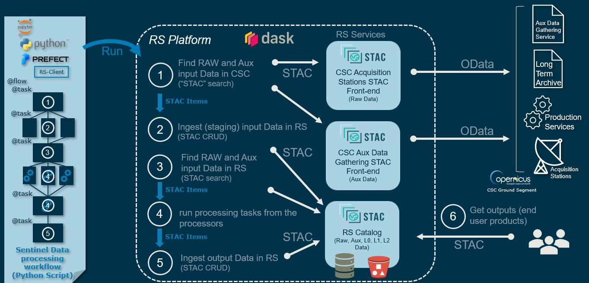

# RS-Server

The Reference System server provides a set of services necessary to build Copernicus processing workflows. All services are subject to access control.

STAC is everywhere with RS-Server. RS-Server offers a catalog of Sentinel products compatible with the STAC (SpatioTemporal Asset Catalog) standard, but also on the next release the staging function to retrieve AUXIP and CADIP data will be provided with a STAC interface.

## Features

To achieve this, RS-Server exposes REST endpoints that allow users to:
-   Search and stage **CADU chunks** from CADIP stations
-   Search and stage **auxiliary data** from AUXIP station
-   Connect to all the endpoints from [SpatioTemporal Asset Catalog API](https://stacspec.org/)

Please note that the STAC catalog will also embed STAC extension to support Sentinel product format from [EOPF-CPM](https://cpm.pages.eopf.copernicus.eu/eopf-cpm/main/index.html).

All these functionalities are available exclusively to authorized users. Permissions can be both technical and
functional.

## User Manual

Access the [User Manual](user_manual.md) for detailed instructions and guidance.

## Developer Manual

Access the [Developer Manual](developer_manual.md) for technical documentation and developer guidelines.
