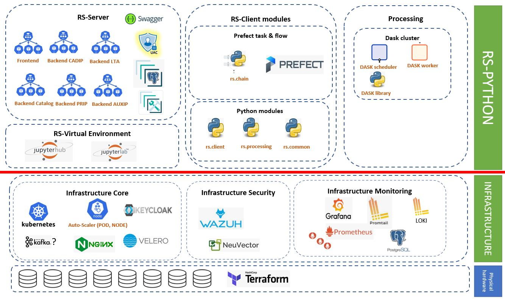

Static View
===========

We can split the system into following Components:

-   **RS-Server**: The RS-Server controls user access to all sensitive
    interfaces: Catalog, LTA, ADGS, PRIP, CADIP. As a consequence, we
    can distinguish following components:

    -   **RS-Server Frontend**

    -   **RS-Server Backend / Catalog**

    -   **RS-Server Backend / PRIP**

    -   **RS-Server Backend / CADIP**

    -   **RS-Server Backend / LTA**

    -   **RS-Server Backend / AUXIP**

-   **RS-Client libraries**: this is a set of python functions that
    provide processing task and flows. Flows and tasks can be
    orchestrated by Prefect server or executed from any Python
    environment. On RS-Server side there will be also function to
    compute performance indicator.

-   **RS-Virtual environment**: Component that gives users access to
    computational environments and resources for executing processing
    chains.

-   **Processing**: this group hosts all components to process Sentinel
    products. The CFI are not part of the group. Only wrappers,
    preparation worker and Dask cluster to provide processing power.
    Here are the components:

    -   **Dask cluster**

    -   **DPR libraries**

-   **Infrastructure**: The infrastructure is a portable, extensible and
    open-source platform orchestrated by Kubernetes. We can isolate two
    specific layout which are monitoring and security. As a consequence,
    we can distinguish following components:

    -   **Infrastructure core**

    -   **Infrastructure monitoring**

    -   **Infrastructure security**

RS Client Libraries
-------------------

Dynamic View
============

The following schema highlights main interactions between the
components.

STAC item lifecycle
-------------------

