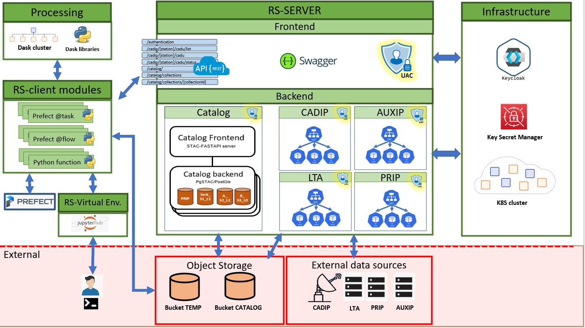

RS-Server inside RS Python
==========================

The **RS-Server** is the major component of **Reference-System Python**. 
It controls user access to all sensitive interfaces:

* Catalog (fine access control per Collection)
* LTA
* ADGS
* PRIP 
* CADIP

The **RS-Server** components are the following ones:

* **RS-Server Frontend**
* **RS-Server Backend / Catalog**
* **RS-Server Backend / PRIP**
* **RS-Server Backend / CADIP**
* **RS-Server Backend / LTA**
* **RS-Server Backend / AUXIP**

Dynamic View
============

On the following schema, we see that RS-Server is in the middle of the system with access control to Copernicus sensitive interfaces.

STAC item lifecycle
-------------------
STAC standard is everywhere on RS. The following schema highligts where a STAC item is created, stored and updated.

