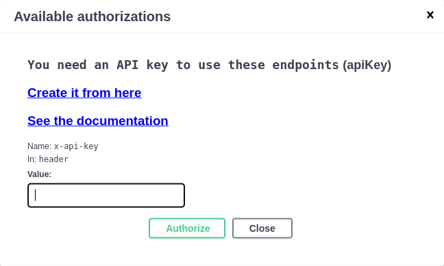

# OAuth2 and API Key Manager

All the RS-Server HTTP services are protected: to use them, you must authenticate using your RS-Server KeyCloak account.

There are two different authentication methods:

  * OAuth2 authentication
  * Using an API Key

When you authenticate with OAuth2, it automatically opens a new KeyCloak logging window:

The downside of this method is that, for security reasons, it has a short lifespan and you have to manually authenticate again every few minutes or hours. So this method cannot be used to run long scripts for example.

This is why we use an API key: after being authenticated with OAuth2, you can create yourself a personal API key, with a longer lifespan, that you will use to authenticate to RS-Server.

To do this:

  1. Go to the [API Key Manager section of the RS-Server frontend](https://rspy.ops.rs-python.eu/docs#/API-Key%20Manager):

  2. Click on the lock icon on the right of the `Create Api Key` endpoint to do a first manual authentication using OAuth2 and KeyCloak.
  3. In the window that opens, click on the green `Authorize` button.

  4. Login to your KeyCloak account if requested (i.e. if your last session has expired).
  5. Note: to login using a different KeyCloak account, either remove your cookies from your browser settings, or use an incognito/private browser session.
  6. Expand the `Create Api Key` endpoint, click the `Try it out` button on the right, fill your API key parameters and click the `Execute` button on the bottom. The parameters are:

      * **name**: free text.
      * **never_expires**: if false, this API key will expire in 15 days.
      * **config**: not used for now.
      * **allowed_referers**: not used for now.

  7. Note your created API key value and save it for later.
  8. Try the other API Key Manager endpoints (they also need OAuth2 authentication using the lock icon on the right):

      * **Show My Information**: show my KeyCloak account information
      * **List My Api Keys**: list all API keys and usage information associated with my account.
      * **Revoke Api Key**: Revoke an API key associated with my account.
      * **Renew Api Key**: Renew an API key associated with my account, reactivate it if it was revoked.

Now you can use your API key to authenticate to RS-Server and call the Auxip, Cadip and STAC catalog HTTP endpoints. If you want to call them from the website, click once again on the lock icons on the right, but this time enter your API key value:

